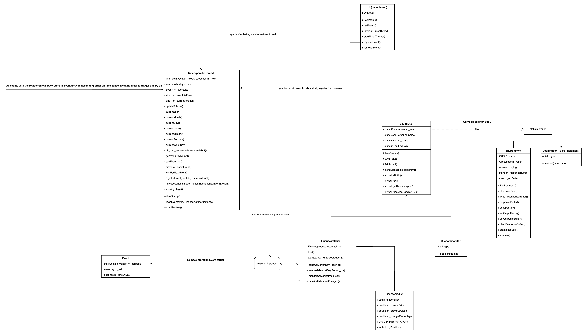

# Introduction
This is a telegram bot which monitor stock price, assignment release, and currency.
It is capable of send you an alert via telegram bot base on the condition set.

# Class diagram 

# Dependencies
g++ , curl

# How to build

# How to test

# How to run

-- # What it does
